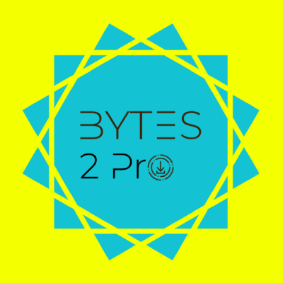

  
  
  # Bytes2Pro
  
  **[bytes2pro.dev](https://bytes2pro.dev)**

Bytes2Pro is a collective of senior developers and technical specialists who architect, build, and scale software systems that drive business outcomes. We bring together experienced freelancers with proven expertise in enterprise environments and significant contributions to open-source infrastructure used by millions.

## Core Competencies

**Full-Stack Development** • Frontend (React, Vue, Angular, TypeScript) • Backend (Node.js, Python, Go, Rust, Java, .NET) • Mobile (React Native, Flutter, native iOS/Android)

**Infrastructure & DevOps** • Cloud architecture (AWS, GCP, Azure) • Kubernetes, Docker, CI/CD • Infrastructure as Code (Terraform), monitoring, observability

**AI & Machine Learning** • LLM integration and fine-tuning • Generative AI • Computer vision and NLP • MLOps and model deployment

**System Design & Architecture** • Microservices and distributed systems • Database design and optimization • Performance optimization and scalability planning

## Open Source & Client Partnerships

We actively contribute to and maintain open-source projects that power modern software development. We partner with businesses to deliver custom software solutions—from initial concept through production deployment—emphasizing technical excellence, maintainable codebases, and scalable solutions.

**Services:** Custom web applications • API development and integration • Technical architecture and consulting • Performance optimization • Team augmentation and technical leadership

[Contact us →](mailto:bytes2pro@gmail.com)
